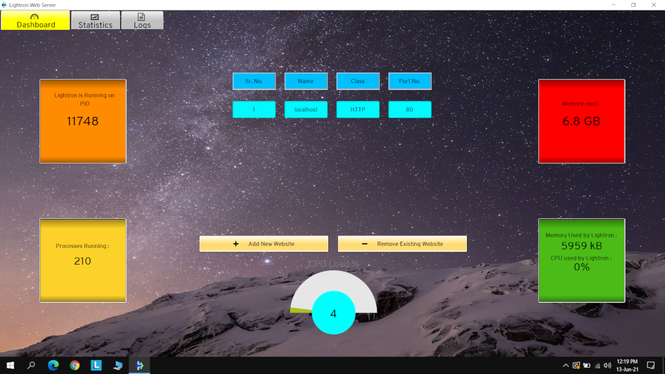
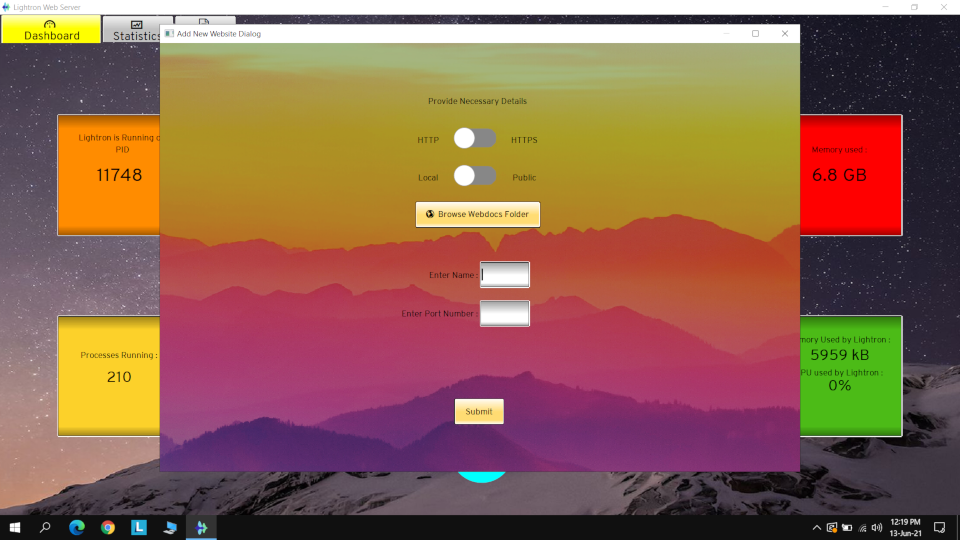
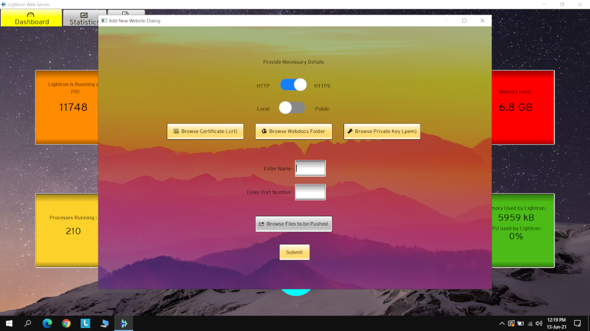
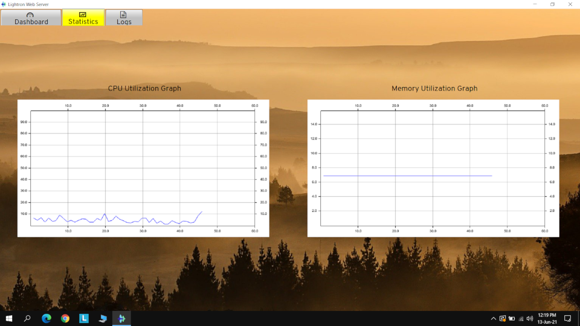

- [Usage](#usage)
  * [Hosting a website](#hosting-a-website)
  * [Features](#features)
    + [Port Based Virtual Hosting](#port-based-virtual-hosting)
    + [Domain Based Virtual Hosting](#domain-based-virtual-hosting)
    + [Server Push](#server-push)
    + [Local vs Public](#local-vs-public)
    + [Realtime Rendering of Graph](#realtime-rendering-of-graph)

# Usage
When you will launch the Lightron Web server GUI the first window that you will see is the Dashboard window.  
  

## Hosting a website
1. Click on the 'Add New Website' button which will open a small dialog box as shown in the above image.
2. Click on 'Browse Webdocs folder' and add the directory which includes the index.html file(this is mandatory) for your website and also include other files such as image files, video files, CSS files or any javascript script that your website uses.  
3. As shown in the image you can choose whether you want to host the website using HTTP or HTTPS protocol.
4. If you want to host using HTTP, you just need to select HTTP and then enter the details asked below and click on submit.
  
 
  
5. If you want to host using HTTPS, you need to select HTTPS which will further ask you to provide the certificates such as .CRT, private key .PEM etc, and then enter the details asked below and click on submit.
  

  
6. After you have submitted the details for your website you will see a table has been created on the dashboard which will display all your website details.
7. Now you need to restart the service of the web server.

## Features
### Port Based Virtual Hosting
* Port based virtual hosting provides hosting of multiple websites on single server but with different port number. You can simply click add new website button and choose different port for multiple websites.
### Domain Based Virtual Hosting
* Domain based virtual hosting provides hosting of multiple websites on single server but with different domain names. To host multiple website on a single port simply choose same port number and enter different domain name and same class HTTP or HTTPS. For development environment you can add hostnames in hosts file.
### Server Push
* Server push is a feature of HTTP/2.0 protocol in which client does not have to request specified files or resources. End result is reduced latency and better throughput. In GUI choose the files that you want to server push. Note: It is only available in HTTPS.
### Local vs Public
* If you choose Local, The server will listen on Loopback interface port and serve the request which has orginated from there. If you choose Public, The server will listen to all interface' port (0.0.0.0) and serve request from all interface.
### Realtime Rendering of Graph
* On statistics tab, you can see the realtime graph of CPU and Memory utilization of system.
  
